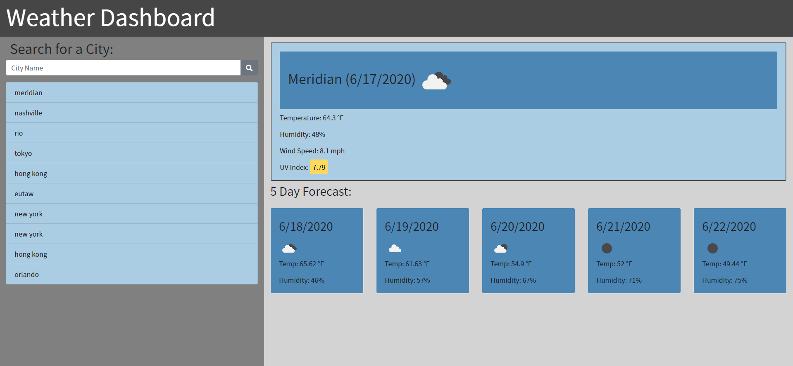

# Weather Dashboard App Description

##Check the site out [here](https://proflonghair07.github.io/Weather_Dashboard/)

This weather app is made up of three different files. An index.html file, a style.css file, and a script.js file.

## The index file contains cd's that link to jquery, bootstrap, font-awesome, google fonts, and the local css style sheet. The page is styled mostly via bootsrap with a small amount of the styling done via the local style sheet. The header uses bootstrap's navbar. The two main sections of the page are nested in a row that is nested in a container. The input area uses a bootsrap input with a placeholder of city name and a button nested within an input-group-append div. The button uses a search icon pulled from font-awesome. Beneath the input area is a list-group div. This is where the city inputs prepended to via that javascript file. The output area contains a card div where the current day weather is projected and another div where the five day forecast is displayed.

## The css file is fairly minimal and does a little basic styling to augment bootsrap. The \* selector is used to set the font of all text on the page to google font's Noto Sans font. There are three classes at the end of the stylesheet called favorable, moderate, and severe. These are called and added to the uvDisplay within the javascript depending on the value of the uv index.

## The script.js file is where the page gets all of its functionality. The page starts with a couple of global variables. The cityName variable and the cityList array. After this the onLoadCityList and onLoadWeather functions are called. These two functions pull user input from local storage to display the cityList array in the list-group div, and to display the most recent city input to the card div in the output area. These are the first functions executed on a reload. The displayCities function uses a for loop that cycles through the cityList array to display the users input as anchors in city-input-list div. The saveCityArray function saves the cityList array to local storage using JSON.stringify. The saveCity function saves the currentCity to local storage using JSON.stringify. Next an event listener is attached to the submit-weather button. The function attached to this event listener adds the users input to the cityList div. It uses conditionals to alert the user if input is left blank by changing the value of the city-input input to "Cannot leave input blank", and to only allow the user to display up to ten inputs. The displayWeather function is an async function. This allows the function to behave asynchronously. This function calls to the openweatherapi via ajax. It adds elements and adds classes to them that are primarily classes from bootsrap's card system but also some are called from the local css. It gets the date, temperature, humidity, wind-speed, png, and uv index of the current city input and displays them to the currentWeatherDisplay div in a bootstrap cardbody. This function also uses conditionals to to add the favorable, moderate, and severe classes the the uvDisplay depending on the number value of the uv index. The displayForecast fucntion also uses async to act asynchronously. Its functionality is very similar to the displayWeather function. It uses ajax to get output from the openweather api as well but in this case only gets the date, png, temperature, and humidity. It renders the output to bootstrap cardbodies in a similar way to the displayWeather function but uses a for loop to make five displays of the upcoming five days. The displayWeatherAnchor function is the function that allows the user to click on an anchor in the city-input-list div and have that render to the weather display. An event listener below it that links to the document allows the functionality.
